# 🍔 FeastOfKings — Mobile Food Ordering App

<div align="center">


**A high-fidelity Android UI/UX prototype for fast, simple food ordering**

[](https://www.android.com/)
[](https://kotlinlang.org/)
[](LICENSE)

[Features](#-features) • [Screenshots](#-screenshots) • [Installation](#-installation) • [Design System](#-design-system) • [Roadmap](#-roadmap)

</div>

---

## 📖 Overview

**FeastOfKings** is designed for busy users (students, professionals) who want **the quickest path from craving to checkout** with minimal friction. The app prioritizes **speed, clarity, and transparency** across all screens with a focus on clean navigation, visual menus, cart/checkout flows, and micro-interactions using **mock/static data**.

> **⚠️ Important:** This is a **UI/UX prototype only** — no backend, payments, or live APIs are integrated.

### 🎯 Primary Goals

- ✅ **Quick meal selection** from an easy, visual menu
- ✅ **Simple ordering & checkout** with minimal steps
- ✅ **Order status UI** (Preparing → On the way → Delivered)
- ✅ **Lightweight support** and **trust cues** (profile, ratings UI)

---

## ✨ Features

### Core Functionality
- 📱 **Onboarding Flow** - Engaging 2-3 slides with HD food imagery
- 🔐 **Authentication** - Clean sign-up/login screens with social login options
- 🏠 **Home Screen** - Category browsing (Burgers, Pizza, Sandwiches) with bottom navigation
- 🍕 **Item Details** - Large images, prices, descriptions, and "Add to Cart" functionality
- 🛒 **Shopping Cart** - Line items with quantity controls, subtotals, and checkout CTA
- 💳 **Checkout Flow** - Address input, payment method selection (mock), and order summary
- 📦 **Order Tracking** - Status UI with visual feedback
- 👤 **User Profile** - Edit personal information and preferences
- 💬 **Support Interface** - Lightweight chat entry UI

### UI/UX Excellence
- 🎨 Warm orange/yellow color palette to stimulate appetite
- 🔍 Search functionality with quick category filters
- ♻️ Reusable components (cards, counters, price/rating widgets)
- 📐 60-30-10 color balance for visual hierarchy
- 👆 Accessible touch targets optimized for one-hand usage
- 🌓 Light/dark theme preparedness with design tokens

---

## 📸 Screenshots

### Authentication & Onboarding
<table>
  <tr>
    <td align="center">
      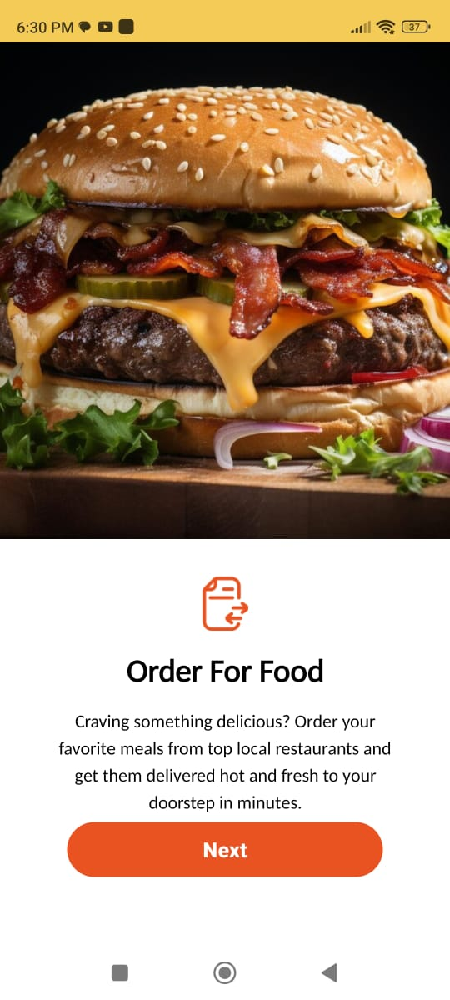<br/>
      <b>Splash Screen</b>
    </td>
    <td align="center">
      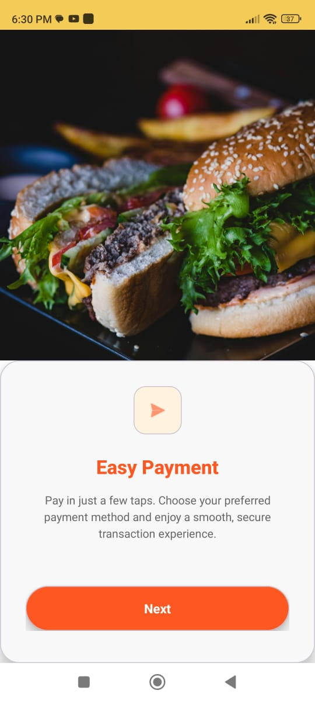<br/>
      <b>Onboarding - Order Food</b>
    </td>
    <td align="center">
      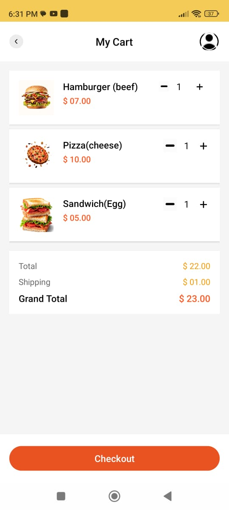<br/>
      <b>Onboarding - Easy Payment</b>
    </td>
    <td align="center">
      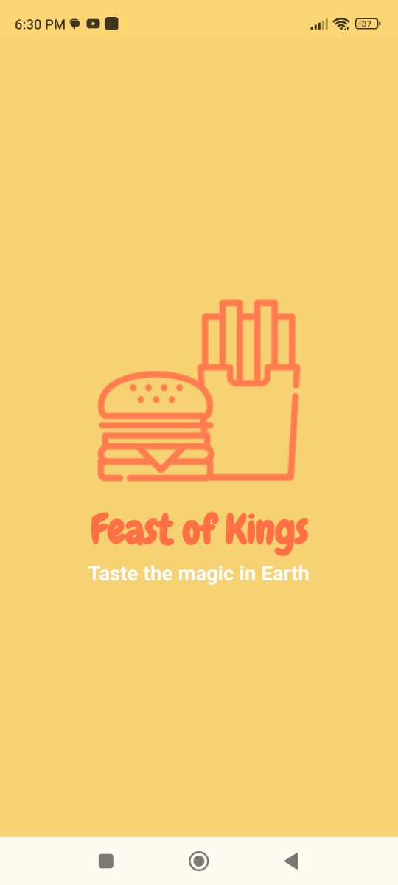<br/>
      <b>Onboarding - Hungry?</b>
    </td>
  </tr>
</table>

### Authentication Screens
<table>
  <tr>
    <td align="center">
      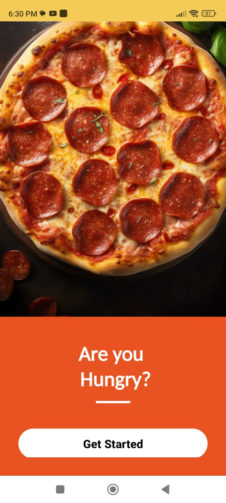<br/>
      <b>Login Screen</b>
    </td>
    <td align="center">
      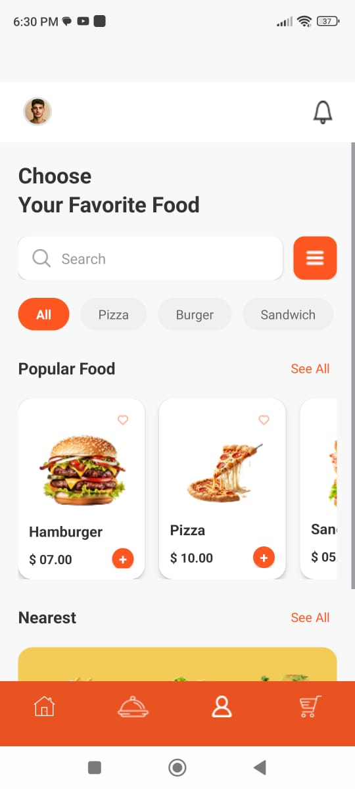<br/>
      <b>Sign Up Screen</b>
    </td>
  </tr>
</table>

### Main App Flow
<table>
  <tr>
    <td align="center">
      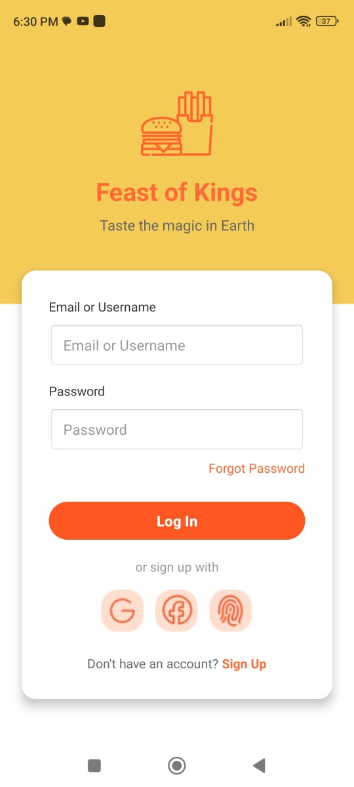<br/>
      <b>Home - Browse Food</b>
    </td>
    <td align="center">
      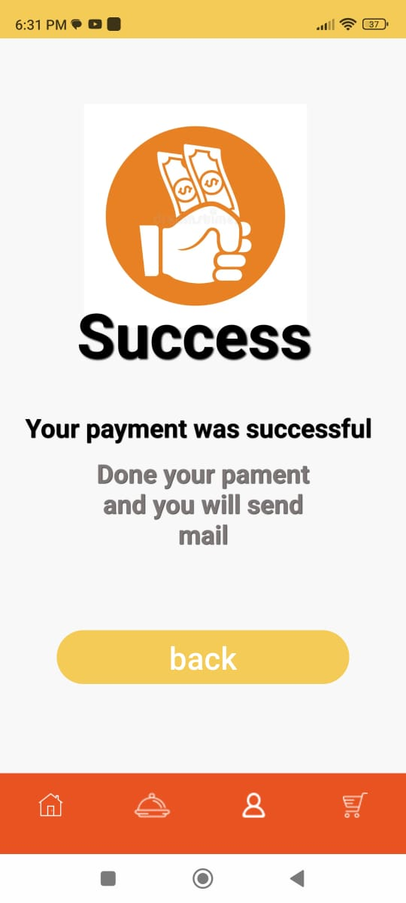<br/>
      <b>Shopping Cart</b>
    </td>
    <td align="center">
      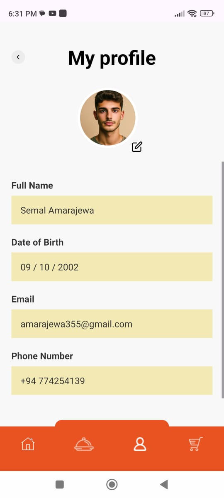<br/>
      <b>Payment Screen</b>
    </td>
    <td align="center">
      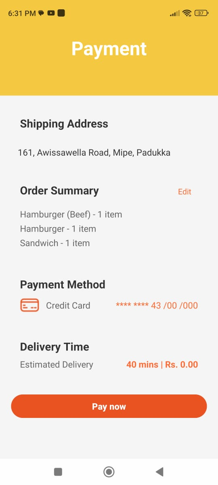<br/>
      <b>Payment Success</b>
    </td>
  </tr>
</table>

### Profile & Settings
<table>
  <tr>
    <td align="center">
      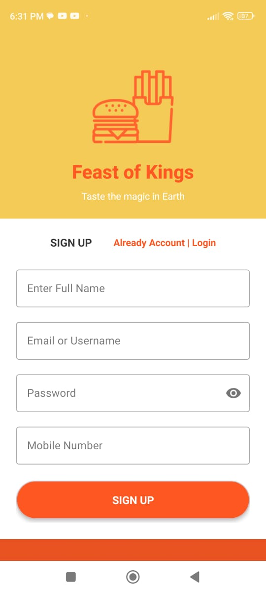<br/>
      <b>User Profile</b>
    </td>
  </tr>
</table>

---

## 🚀 Installation

### Prerequisites
- **Android Studio** (Arctic Fox or later)
- **JDK 11** or higher
- **Android SDK** (API Level 24+)
- **Gradle 7.0+**

### Setup Instructions

1. **Clone the repository**
   ```bash
   git clone https://github.com/arindu123/FeastOfKings.git
   cd FeastOfKings
   ```

2. **Open in Android Studio**
   - Launch Android Studio
   - Select `File → Open`
   - Navigate to the cloned directory
   - Click `OK` and wait for Gradle sync

3. **Run the app**
   - Connect an Android device or start an emulator
   - Click the `Run` button (▶️) or press `Shift + F10`
   - Select your target device
   - The app uses **mock/static data** — no additional setup required

---

## 🎨 Design System

### Color Palette
```xml
<!-- Primary Colors -->
<color name="primary_orange">#E94E1B</color>
<color name="primary_yellow">#F4B942</color>
<color name="background_cream">#FFF8E7</color>

<!-- Accent Colors -->
<color name="accent_dark_orange">#D43D0A</color>
<color name="text_primary">#2E2E2E</color>
<color name="text_secondary">#757575</color>

<!-- UI Elements -->
<color name="white">#FFFFFF</color>
<color name="light_gray">#F5F5F5</color>
<color name="border_gray">#E0E0E0</color>
```

### Typography Hierarchy
- **Display Text**: Bold, 28-32sp (Screen titles)
- **Headline**: SemiBold, 20-24sp (Section headers)
- **Body**: Regular, 14-16sp (Descriptions, content)
- **Caption**: Regular, 12-14sp (Hints, labels)

### Design Principles
- **60-30-10 Rule**: 60% neutral, 30% primary orange/yellow, 10% accents
- **Generous Whitespace**: Reduces cognitive load and improves scanning
- **Visual Hierarchy**: Clear distinction between primary and secondary actions
- **Mobile-First**: Optimized for vertical scroll and thumb-friendly interactions

---

## 🗂️ Project Structure

```
FeastOfKings/
├── app/
│   ├── src/
│   │   ├── main/
│   │   │   ├── java/com/feastofkings/
│   │   │   │   ├── activities/
│   │   │   │   │   ├── MainActivity.kt
│   │   │   │   │   ├── LoginActivity.kt
│   │   │   │   │   ├── SignUpActivity.kt
│   │   │   │   │   ├── HomeActivity.kt
│   │   │   │   │   └── ProfileActivity.kt
│   │   │   │   ├── fragments/
│   │   │   │   │   ├── CartFragment.kt
│   │   │   │   │   └── OrdersFragment.kt
│   │   │   │   ├── adapters/
│   │   │   │   │   ├── FoodItemAdapter.kt
│   │   │   │   │   └── CartAdapter.kt
│   │   │   │   ├── models/
│   │   │   │   │   ├── FoodItem.kt
│   │   │   │   │   ├── CartItem.kt
│   │   │   │   │   └── User.kt
│   │   │   │   └── utils/
│   │   │   │       └── MockData.kt
│   │   │   ├── res/
│   │   │   │   ├── layout/
│   │   │   │   ├── drawable/
│   │   │   │   ├── values/
│   │   │   │   │   ├── colors.xml
│   │   │   │   │   ├── strings.xml
│   │   │   │   │   └── styles.xml
│   │   │   │   └── mipmap/
│   │   │   └── AndroidManifest.xml
├── screenshots/
├── README.md
└── LICENSE
```

---

## 🎯 User Flow

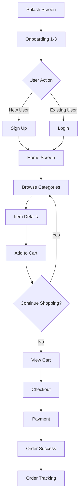

---

## 🔧 Technologies Used

### Core
- **Language**: Kotlin
- **UI Framework**: Android XML Layouts
- **Architecture**: MVVM-ready structure
- **Build System**: Gradle

### Libraries (Future Integration)
- **Navigation**: Android Navigation Component
- **Image Loading**: Glide / Coil
- **Networking**: Retrofit + OkHttp (for future API integration)
- **Local Storage**: Room Database
- **Dependency Injection**: Hilt / Koin

---

## 🗺️ Roadmap

### Phase 1: Current (UI Prototype) ✅
- [x] Complete UI/UX screens
- [x] Mock data integration
- [x] Basic navigation flow
- [x] Design system documentation

### Phase 2: Backend Integration 🚧
- [ ] REST API implementation
- [ ] User authentication (Firebase Auth)
- [ ] Real-time database (Firestore)
- [ ] Image storage (Firebase Storage)

### Phase 3: Advanced Features 📋
- [ ] Payment gateway integration (Stripe/PayPal)
- [ ] Live GPS order tracking
- [ ] Push notifications
- [ ] Favorites & order history
- [ ] Ratings & reviews system
- [ ] Coupon/discount system

### Phase 4: Optimization 🎯
- [ ] Performance optimization
- [ ] Accessibility improvements (TalkBack support)
- [ ] Multi-language support
- [ ] Dark mode implementation
- [ ] Tablet layout optimization

---

## 🤝 Contributing

Contributions are welcome! Please follow these steps:

1. Fork the repository
2. Create a feature branch (`git checkout -b feature/AmazingFeature`)
3. Commit your changes (`git commit -m 'Add some AmazingFeature'`)
4. Push to the branch (`git push origin feature/AmazingFeature`)
5. Open a Pull Request

### Contribution Guidelines
- Follow existing code style and naming conventions
- Write clear commit messages
- Update documentation for new features
- Test thoroughly before submitting PR

---

## 📝 License

This project is licensed under the **MIT License** - see the [LICENSE](LICENSE) file for details.

---

## 👨‍💻 Author

**Semal Arindu**  
*Coursework Project - IT2010 Mobile Application Development, SLIIT*

- GitHub: [@arindu123](https://github.com/arindu123)
- Email: amarajewa355@gmail.com
- Phone: +94 774254139

---

## 🙏 Acknowledgments

- **SLIIT** - Sri Lanka Institute of Information Technology
- **Course**: IT2010 - Mobile Application Development
- **Icons**: [Lucide Icons](https://lucide.dev/)
- **Inspiration**: Modern food delivery apps (Uber Eats, DoorDash)

---

## 📞 Support

If you encounter any issues or have questions:

1. Check existing [Issues](https://github.com/arindu123/FeastOfKings/issues)
2. Create a new issue with detailed description
3. Contact via email: amarajewa355@gmail.com

---

<div align="center">

### ⭐ If you like this project, please give it a star!

**Made with ❤️ and 🍕 by Semal Arindu**

</div>
